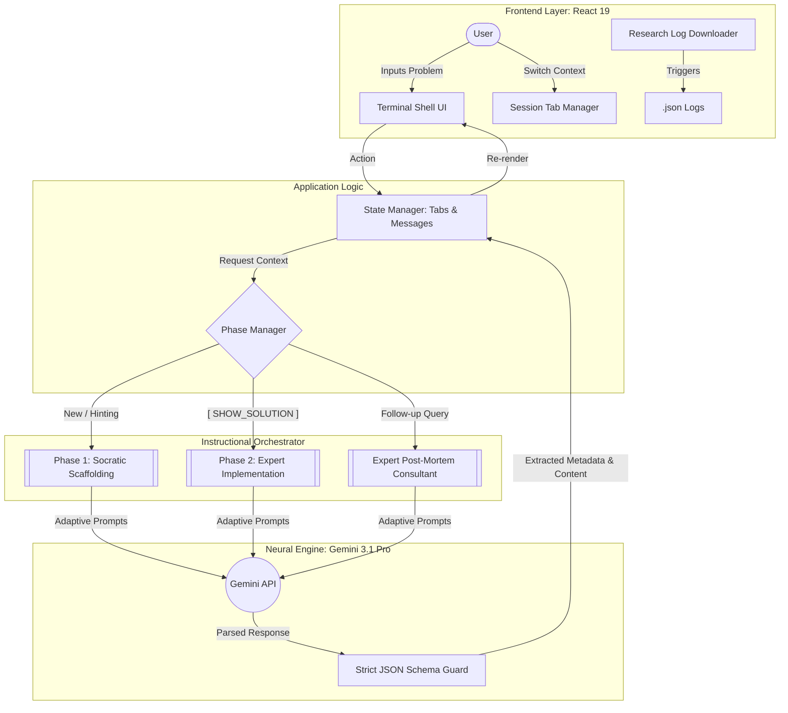

# HintFlow 🚀

**HintFlow** is an AI-powered Socratic coding tutor designed specifically for computer science students and research analysis. Instead of providing immediate solutions, HintFlow guides users through programming problems using progressive scaffolding, high-depth technical analysis, and data-rich interactions.

<!--  -->

## ✨ Features

- **Unix Terminal Aesthetic**: A professionally crafted, high-contrast UI inspired by classic shell environments and `tmux` multiplexers, using **Fira Code** for all typography.
- **Selective Language Generation**: Users select a target language (Python, C++, or C) before starting, reducing token overhead by ~65% and drastically improving performance.
- **Phase-Based Retrieval (Lazy Loading)**: Implements a dual-phase execution model. Hints are generated instantly (Phase 1), while full solutions and deep-dives are fetched only upon request (Phase 2).
- **Data-Rich Interactions (Research Mode)**: Automatically extracts metadata such as `topic_tags`, `difficulty_score`, and `technical_depth_score` for quantifiable learning analysis.
- **Socratic "Check for Understanding"**: Generates dynamic `reflective_questions` to force conceptual engagement before code disclosure.
- **Adaptive Scaffolding**: Analyzes user-provided code for specific logic errors and tailors the initial hint sequence to address those unique mistakes.
- **Expert Post-Mortem**: Once solved, HintFlow transitions into **Expert Implementation Mode**, providing high-depth technical analysis of memory management, performance trade-offs, and first-principles mechanics.
- **Complexity Analysis Card**: Dedicated UI for mandatory $O(n)$ Time and Space complexity metrics.
- **Common Pitfalls**: Identifies frequent student bugs and edge cases specific to the problem.
- **Download Research Logs**: Integrated one-click JSON export of the entire session (all tabs, messages, and AI-extracted metadata) for academic analysis and performance tracking.

## 🛠️ Tech Stack

- **Frontend**: React 19, TypeScript, Vite
- **AI Engine**: Google Gemini 3.1 Pro (via `@google/genai`)
- **Styling**: Tailwind CSS 4
- **Animations**: Motion
- **Icons**: Lucide React
- **Syntax Highlighting**: React Syntax Highlighter (Prism)
- **Math Support**: Full LaTeX support for algorithmic expressions using KaTeX.

## 🚀 Getting Started

### Prerequisites

- [Node.js](https://nodejs.org/) (v18 or higher)
- [npm](https://www.npmjs.com/) (v9 or higher)
- A Google Gemini API Key (Get one at [Google AI Studio](https://aistudio.google.com/))

### Installation

1. **Clone or download** the repository.
2. **Install dependencies**:
   ```bash
   npm install
   ```
3. **Configure Environment**: Add your `GEMINI_API_KEY` to your environment variables or a `.env` file.

### Running the App

```bash
npm run dev
```
The app will be available at `http://localhost:3000`.

## 📖 Interactive Workflow

1. **Language Selection**: Select **Python**, **C++**, or **C** at the bottom of the terminal before starting. This optimizes the AI's internal reasoning for that specific syntax.
2. **Input Challenge**: Type your problem statement at the `student@hintflow %` prompt.
3. **Analyze Scaffolding**: Review the **Big Idea** and work through the progressive hints.
4. **Solve Reflection**: Answer the `THINK_ABOUT_THIS` reflective question before unveiling the solution.
5. **Code Inspection**: Fetch the full solution. Use the **Complexity Analysis** card to understand $O(n)$ performance metrics.
6. **Expert Follow-up**: Ask descriptive questions for a deep-dive post-mortem analysis.
7. **Export Logs**: Click the download icon to save the session metadata for your research.

## 🧠 Under the Hood

### System Architecture



### Instructional Modes
HintFlow utilizes a specialized state-machine for pedagogical delivery:

1. **HINT_MODE (Phase 1)**: Focuses on "Desirable Difficulty." It provides conceptual analogies, pseudocode strategies, and a "reflective question" to ensure the student builds a mental map before viewing code.
2. **SOLUTION_MODE (Phase 2)**: Triggered on-demand. Generates an idiomatic, production-grade implementation with trade-off analysis (e.g., Iterative vs Recursive) and common pitfalls.
3. **FOLLOWUP_MODE (Post-Mortem)**: Acts as an **Expert Implementation Consultant**. It answers "under the hood" questions regarding stack frames, memory management, and real-world engineering scenarios.

### Research & Data Quantification
To support technical publications and quantifiable analysis, every AI response includes research metrics:
- **`topic_tags`**: For domain difficulty analysis.
- **`difficulty_score` (1-10)**: Quantifies the cognitive load of a given problem.
- **`technical_depth_score` (1-5)**: Measures the complexity of expert follow-up responses.

#### 📊 Data Export (Research Logs)
The `[ DOWNLOAD_LOGS ]` button (invoked via the download icon) exports the full session state as a structured JSON file. This includes:
- **Global Metadata**: Device-agnostic timestamps and session identifiers.
- **Transcript Data**: Every user prompt vs. AI response sequence.
- **Extracted Metrics**: All cognitive load scores and topic tags for each interaction.
- **Complexity Analysis**: Captured Time/Space complexity data for solutions.

Researchers can ingest these JSON logs into Python (Pandas/Matplotlib) or R for large-scale analysis of student learning curves and AI pedagogical efficacy.

### Structured Response Schema
HintFlow leverages **STRICT JSON** enforcement to ensure the React frontend remains robust. The schema evolves based on the active phase:

**Phase 1 Response:**
```json
{
  "isRelevant": boolean,
  "topic_tags": ["Recursion", "Arrays"],
  "difficulty_score": 7,
  "overview": "Big Idea explanation...",
  "hints": ["Hint 1", "Hint 2"],
  "reflective_question": "Socratic CFU..."
}
```

**Phase 2 Response:**
```json
{
  "solution": "Full code implementation...",
  "language": "python",
  "complexity": { "time": "O(n log n)", "space": "O(n)" },
  "explanation": "Deep dive text...",
  "pitfalls": ["Common bug 1", "Common bug 2"]
}
```

**Follow-up Response:**
```json
{
  "overview": "Direct expert answer...",
  "technical_depth_score": 4,
  "hints": []
}
```

## 📜 License

This project is licensed under the **Apache-2.0 License**.

---
*Built for the next generation of software engineers and researchers.*
