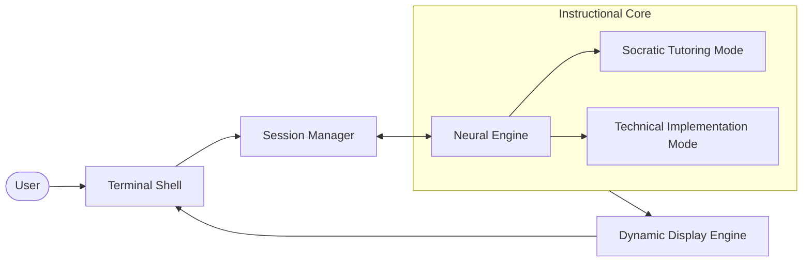

# HintFlow 🚀

**HintFlow** is an AI-powered Socratic coding tutor designed specifically for computer science students and beginners. Instead of providing immediate solutions, HintFlow guides users through programming problems using progressive hints, helping them develop problem-solving skills and a deeper understanding of coding logic.

)

## ✨ Features

- **Unix Terminal Aesthetic**: A professionally crafted, high-contrast UI inspired by classic shell environments and `tmux` multiplexers, using **Fira Code** for all typography.
- **Dynamic Tab System**: Manage multiple coding challenges simultaneously with a session-aware tab bar. Each problem lives in its own "terminal tab".
- **Follow-up Interaction**: Ask descriptive questions after a solution is revealed. HintFlow switches from Socratic hints to expert implementation dialogue once the core logic is understood.
- **Socratic Tutoring**: Provides high-level overviews and conceptual nudges before showing code.
- **Progressive Hints**: Reveal 3-5 hints one by one, scaling from conceptual logic to specific language syntax.
- **Multi-Language Support**: Provides industrial-grade solutions in C, C++, and Python.
- **Mobile Responsive**: Fully optimized for mobile shell experiences, providing a productive environment on any device.
- **Academic Standards**: All code solutions follow professional formatting standards to encourage best practices.
- **Code Editor View**: Full solutions are displayed with syntax highlighting, line numbers, and language toggles.
- **Recommended Resources**: Automatically suggests relevant books and online documentation for deep-dive learning.
- **Math Support**: Full LaTeX support for algorithmic complexity and data science expressions using KaTeX.
- **No Spoilers**: Solutions and hints are hidden behind intentional disclosure triggers.

## 🛠️ Tech Stack

- **Frontend**: React 19, TypeScript, Vite
- **AI Engine**: Google Gemini 3.1 Pro (via `@google/genai`)
- **Styling**: Tailwind CSS 4
- **Animations**: Motion
- **Icons**: Lucide React
- **Syntax Highlighting**: React Syntax Highlighter (Prism)
- **Markdown**: React Markdown

## 🚀 Getting Started

### Prerequisites

- [Node.js](https://nodejs.org/) (v18 or higher)
- [npm](https://www.npmjs.com/) (v9 or higher)
- A Google Gemini API Key (Get one for free at [Google AI Studio](https://aistudio.google.com/))

### Installation

1. **Clone or download** the repository to your local machine.
2. **Navigate** to the project directory:
   ```bash
   cd HintFlow
   ```
3. **Install dependencies**:
   ```bash
   npm install
   ```

### Configuration

1. Create a `.env` file in the root directory:
   ```bash
   touch .env
   ```
2. Add your Gemini API key to the `.env` file:
   ```env
   GEMINI_API_KEY=your_api_key_here
   ```

### Running the App

Start the development server:
```bash
npm run dev
```
The app will be available at `http://localhost:3000`.

## 📖 How to Use

1. **Enter a Problem**: Type your challenge at the `[student@hintflow %]` prompt.
2. **Review Terminal Output**: HintFlow will output a conceptual breakdown and "Learning Path".
3. **Reveal Clues**: Use the `[ REVEAL_HINT ]` command triggers to see progressive layers of logic.
4. **Inspect Solution**: Execute `[ SHOW_SOLUTION ]` to view the full industrial-grade implementations.
5. **Ask Follow-ups**: Once solved, type further questions to get expert-level implementation advice.
6. **Manage Sessions**: Use the top tab bar to switch between different problem shells or start a `[+]` new one.

## 🧠 Under the Hood

### System Architecture


### Socratic Prompting Strategy
HintFlow uses a specialized **System Instruction** to guide the Gemini 3.1 Pro model. Instead of a standard chat interface, the model is instructed to act as a "Socratic Tutor" focusing on "Guided Discovery". It follows a rigorous multi-step reasoning process:
1. **Relevance Check**: Evaluates if the input is a programming problem or general off-topic conversation and handles non-coding prompts with a polite redirection.
2. **Pedagogical Overview**: Identifies core CS concepts and explains the problem's context without revealing the solution.
3. **Structured Scaffolding**: Generates exactly 3-4 hints that transition from abstract logic to algorithmic structure, and finally to implementation-specific syntax.
4. **Professional Multi-Language Implementations**: Provides production-grade code in C (C11/17), C++ (C++17/20), and Python (PEP 8) with modern standards.
5. **Logic Deep Dive**: Analyzes the "How" and "Why", including **Big O Time and Space Complexity** analysis.
6. **Academic Resources**: Curates a list of top-tier textbooks (Title/Author) and authoritative websites for further study.

### Structured Data Flow
To ensure the UI remains consistent, HintFlow leverages **JSON Schema** enforcement. The Gemini API returns a structured object:
```json
{
  "isRelevant": boolean,
  "overview": "string",
  "hints": ["string", "string", "string"],
  "solutions": {
    "c": "string",
    "cpp": "string",
    "python": "string"
  },
  "explanation": "string",
  "resources": {
    "books": [{ "title": "string", "author": "string" }],
    "websites": [{ "name": "string", "url": "string" }]
  }
}
```
This allows the React frontend to parse the response reliably and manage the state of hidden/revealed content.

### Progressive Revelation Logic
The frontend manages the "Hint State" using React hooks. Hints are stored in an array but only rendered based on a `visibleHintsCount` state. This ensures that users aren't overwhelmed and are encouraged to think through each step before moving to the next.

### Professional Code Rendering
For the solution view, HintFlow integrates `react-syntax-highlighter` with the **Prism** engine. It uses the `vscDarkPlus` theme and custom CSS to simulate a real-world IDE experience, complete with line numbers and optimized line heights.

## 📜 License

This project is licensed under the **Apache-2.0 License**. See the source files for more details.

---
*Built for the next generation of software engineers.*
