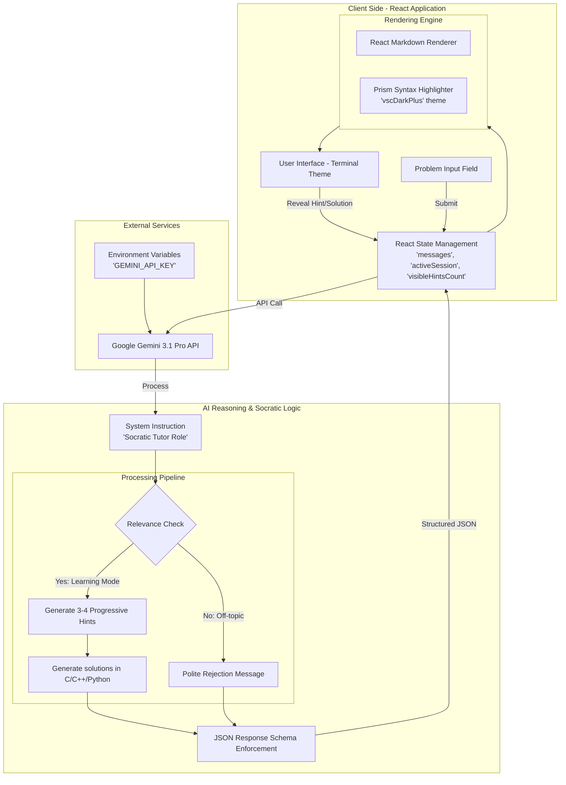

# HintFlow 🚀

**HintFlow** is an AI-powered Socratic coding tutor designed specifically for computer science students and beginners. Instead of providing immediate solutions, HintFlow guides users through programming problems using progressive hints, helping them develop problem-solving skills and a deeper understanding of coding logic.


## ✨ Features

- **Socratic Tutoring**: Provides high-level overviews and conceptual nudges before showing code.
- **Progressive Hints**: Reveal 3-4 hints one by one, from conceptual logic to specific syntax details, now including **helpful code snippets** for clearer implementation cues.
- **Multi-Language Support**: Provides solutions in C, C++, and Python, allowing students to compare implementations across different paradigms.
- **Academic Standards**: All code solutions follow professional formatting standards (PEP 8 for Python; standard C/C++ conventions) to encourage best practices from day one.
- **Code Editor View**: Full solutions are displayed in a professional, multi-line code editor with syntax highlighting, line numbers, and a language toggle.
- **Recommended Resources**: Automatically suggests relevant books (title and author) and online resources (name and URL) to help users expand their knowledge after seeing the solution.
- **Relevance Filtering**: Intelligently identifies and filters out non-programming prompts to stay focused on coding education.
- **Terminal Aesthetic**: A clean, dark-themed UI inspired by classic developer environments.
- **Math Support**: Full LaTeX support for mathematical symbols and equations using KaTeX, perfect for algorithm complexity and data science problems.
- **No Spoilers**: Solutions are hidden behind a "Reveal" button to prevent accidental spoilers.

## 🛠️ Tech Stack

- **Frontend**: React 19, TypeScript, Vite
- **AI Engine**: Google Gemini 3.1 Pro (via `@google/genai`)
- **Styling**: Tailwind CSS 4
- **Animations**: Motion
- **Icons**: Lucide React
- **Syntax Highlighting**: React Syntax Highlighter (Prism)
- **Markdown**: React Markdown

## 🚀 Getting Started

### Prerequisites

- [Node.js](https://nodejs.org/) (v18 or higher)
- [npm](https://www.npmjs.com/) (v9 or higher)
- A Google Gemini API Key (Get one for free at [Google AI Studio](https://aistudio.google.com/))

### Installation

1. **Clone or download** the repository to your local machine.
2. **Navigate** to the project directory:
   ```bash
   cd HintFlow
   ```
3. **Install dependencies**:
   ```bash
   npm install
   ```

### Configuration

1. Create a `.env` file in the root directory:
   ```bash
   touch .env
   ```
2. Add your Gemini API key to the `.env` file:
   ```env
   GEMINI_API_KEY=your_api_key_here
   ```

### Running the App

Start the development server:
```bash
npm run dev
```
The app will be available at `http://localhost:3000`.

## 📖 How to Use

1. **Enter a Problem**: Paste a coding problem statement (e.g., "Write a function to check if a number is prime").
   - *Note: HintFlow will filter out prompts that are not related to programming.*
2. **Read the Overview**: HintFlow will provide a conceptual explanation of the problem.
3. **Reveal Hints**: Click "Reveal Next Hint" to get progressive clues about the logic and syntax.
4. **Solve It**: Try to write the code yourself based on the hints!
5. **Check the Solution**: If you're stuck or want to compare your work, click "Reveal Full Solution" to see the Python implementation and a detailed explanation.

## 🧠 Under the Hood

### System Architecture


### Socratic Prompting Strategy
HintFlow uses a specialized **System Instruction** to guide the Gemini 3.1 Pro model. Instead of a standard chat interface, the model is instructed to act as a "Socratic Tutor." It follows a strict multi-step reasoning process:
1. **Relevance Check**: The model first evaluates if the input is a programming problem.
2. **Conceptual Overview**: It identifies the core CS concepts involved (e.g., recursion, data structures).
3. **Hint Generation**: It creates 3-4 hints that progressively move from abstract logic to specific implementation details.
5. **Solution Guarding**: It provides full, well-formatted solutions in C, C++, and Python, along with a deep-dive explanation.
6. **Curated Resources**: It identifies 3 relevant books and 3 high-authority online resources for continued learning. If no relevant books are found, it only provides online resources.

### Structured Data Flow
To ensure the UI remains consistent, HintFlow leverages **JSON Schema** enforcement. The Gemini API returns a structured object:
```json
{
  "isRelevant": boolean,
  "overview": "string",
  "hints": ["string", "string", "string"],
  "solutions": {
    "c": "string",
    "cpp": "string",
    "python": "string"
  },
  "explanation": "string",
  "resources": {
    "books": [{ "title": "string", "author": "string" }],
    "websites": [{ "name": "string", "url": "string" }]
  }
}
```
This allows the React frontend to parse the response reliably and manage the state of hidden/revealed content.

### Progressive Revelation Logic
The frontend manages the "Hint State" using React hooks. Hints are stored in an array but only rendered based on a `visibleHintsCount` state. This ensures that users aren't overwhelmed and are encouraged to think through each step before moving to the next.

### Professional Code Rendering
For the solution view, HintFlow integrates `react-syntax-highlighter` with the **Prism** engine. It uses the `vscDarkPlus` theme and custom CSS to simulate a real-world IDE experience, complete with line numbers and optimized line heights.

## 📜 License

This project is licensed under the **Apache-2.0 License**. See the source files for more details.

---
*Built for the next generation of software engineers.*
